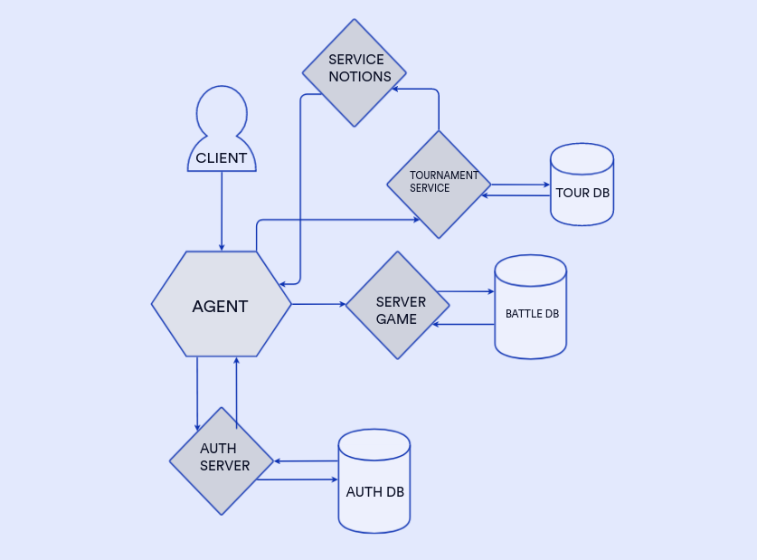

# tankBattle-microseviceArchitecture
Диаграмма архитектуры приложения для игры в танки

1. Определить набор микросервисов и веб-приложений и отобразить их на диграмме/наборе диаграмм.

2. Определить направления обмена сообщениями и Endpoints для каждого микросервиса и приложения + п.4 текстовые пояснения к созданному решению.
###### Танковые бои проводятся как в рамках турниров, либо между любыми пользователями по договоренности.Игрок участвует в танковом бое посредством программы, которая загружается в специальное приложение Агент.
I. AGENT - выступает в роли API-гейтвей, принимает и маршрутизирует все внешних запросы к системе.
* /authenticate:  аутентификация пользователя и получение токена доступа.
* /tournament/application: Позволяет участникам подавать заявки на участие в турнире. 
* /tournament/results: Получает результаты прошедших турниров.
* /tournaments - эндпоинт для получения списка турниров. 
* /tournaments/{tournamentId}/apply - эндпоинт для подачи заявки на участие в турнире. 
* /tournaments/{tournamentId}/results - эндпоинт для получения результатов турнира. 
* /battles/{battleId} - эндпоинт для получения информации о конкретном бое. 
* /battles - эндпоинт для создания нового танкового боя
###### Танковые бои могут проводить только зарегистрированные пользователи.
II. AUTH SERVER - осуществляет аутентификацию пользователей и управление их учетными записями. Взаимодействует с базой данных пользователей с информацией о зарегистрированных пользователях и их учетных данных.
* /signup: Регистрирует нового пользователя, создавая учетную запись в базе данных пользователей. 
* /login: Проверяет учетные данные пользователя и создает JWT-токен в случае успешной аутентификации.
###### Можно посмотреть список будущих турниров, подать заявку на участие в турнире, посмотреть результаты проходящих турниров, уже прошедших. Каждый пользователь может организовать свой турнир. Турниры получают рейтинг, который рассчитывается на основе рейтингов ее участников. Турнир может быть регулярным, тогда рейтинг его накапливается.
III. TOURNAMENT SERVICE - обеспечивает функциональность, связанную с турнирами, взаимодействует с  базой данных турниров с информацией о текущих и прошедших турнирах и рейтингах турнира
* /tournaments: Возвращает список будущих турниров, доступных для регистрации. 
* /tournaments/{tournamentId}/apply: Позволяет участникам подать заявку на участие в конкретном турнире. 
* /tournaments/{tournamentId}/results: Возвращает результаты прошедших турниров. 
* /tournaments - эндпоинт для создания нового турнира. 
* /tournaments/{tournamentId} - эндпоинт для получения информации о конкретном турнире.
* /tournaments/{tournamentId}/participants - эндпоинт для получения списка участников турнира. 
* /tournaments/{tournamentId}/results - эндпоинт для получения результатов турнира. 
* /tournaments/{tournamentId}/ratings - эндпоинт для получения рейтинговых очков турнира 
* /tournaments/ratings - эндпоинт для получения рейтинговых очков всех турниров
###### Участники боев получают уведомлении о приглашении на турнир, решение по заявке на участие в турнире, о завершении танкового боя, о скором начале стартового боя.
IV. SERVICE NOTIONS – представляет собой брокер сообщений и занимается отправкой уведомлений о приглашении на турнир, решение по заявке на участие в турнире, о завершении танкового боя, о скором начале стартового боя.
###### Участник танкового боя может посмотреть прошедший бой. За места в турнире участники получают рейтинговые очки.
V. SERVER GAME - отвечает за логику танковых боев, использует базу данных с информацией о боях, результаты которых сохраняются после завершения, предоставляет API для управления танковыми боями, включая создание новых боев, просмотр прошедших боев и получение информации о боях.
* /battles - эндпоинт для создания нового танкового боя 
* /battles/{battleId} - эндпоинт для получения информации о конкретном бое. 
* / battles/{battleId}/gameSettings – список команд и настройки для боя 
* /battles/{battleId}/results - эндпоинт для получения результатов боя. 
* /battles/raitings – рейтинг участников боев