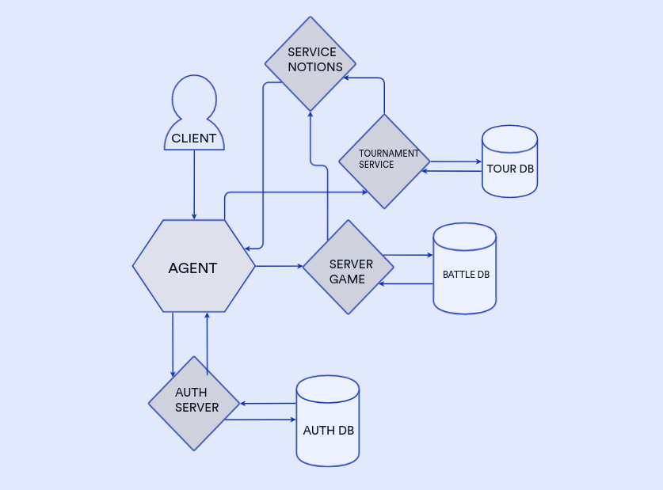

# tank-battle-microsevice-architecture

## Диаграмма архитектуры приложения для игры в танки

*п. ТЗ №1* 

Определить набор микросервисов и веб-приложений и отобразить их на диграмме/наборе диаграмм.

*п. ТЗ №2 + п. №5*

Определить направления обмена сообщениями и Endpoints для каждого микросервиса и приложения + п. №5 текстовые
пояснения к созданному решению.

###### Танковые бои проводятся как в рамках турниров, либо между любыми пользователями по договоренности.Игрок участвует в танковом бое посредством программы, которая загружается в специальное приложение Агент.

#### I. AGENT - выступает в роли API-гейтвей, принимает и маршрутизирует все внешних запросы к системе.

auth endpoint:

* /agent/authenticate:  аутентификация пользователя и получение токена доступа.

tournament endpoints:

* /agent/tournaments - список будущих турниров.
* /agent/tournament/application - позволяет участникам подавать заявки на участие в турнире.
* /agent/tournaments/{tournamentId}/results - эндпоинт для получения результата конкретного турнира.
* /agent/tournament/results - результаты прошедших турниров.
* /agent/createTournament - эндпоинт для организации нового турнира.
* /agent/tournaments/{tournamentId}/ratings - эндпоинт для получения рейтинговых очков турнира.
* /agent/tournaments/ratings - эндпоинт для получения рейтинговых очков всех турниров.

server game endpoints:

* /agent/createBattle - создание нового танкового боя.
* /agent/battles/{battleId} - получение информации о конкретном бое.
* /agent/battles/{battleId}/gameSettings – настройки боя и танка.
* /agent/battles/{battleId}/results - получение результатов боя.
* /agent/battles/{battleId}/ratings – рейтинг участников конкретного боя.
* /agent/battles/ratings – рейтинг участников боев.

###### Танковые бои могут проводить только зарегистрированные пользователи.

#### II. AUTH SERVER - осуществляет аутентификацию пользователей и управление их учетными записями. Взаимодействует с базой

данных пользователей с информацией о зарегистрированных пользователях и их учетных данных.

* /signup: Регистрирует нового пользователя, создавая учетную запись в базе данных пользователей.
* /login: Проверяет учетные данные пользователя и создает JWT-токен в случае успешной аутентификации.

###### Можно посмотреть список будущих турниров, подать заявку на участие в турнире, посмотреть результаты проходящих турниров, уже прошедших. Каждый пользователь может организовать свой турнир. Турниры получают рейтинг, который рассчитывается на основе рейтингов ее участников. Турнир может быть регулярным, тогда рейтинг его накапливается.

#### III. TOURNAMENT SERVICE - обеспечивает функциональность, связанную с турнирами, взаимодействует с базой данных турниров

с информацией о текущих и прошедших турнирах и рейтингах турнира

* /tournaments - возвращает список будущих турниров, доступных для регистрации.
* /tournaments/{tournamentId}/apply: Позволяет участникам подать заявку на участие в конкретном турнире.
* /tournaments/{tournamentId}/results - эндпоинт для получения результатов конкретного турнира.
* /tournaments/results - результаты прошедших турниров.
* /createTournament - эндпоинт для организации нового турнира.
* /tournaments/{tournamentId}/ratings - эндпоинт для получения рейтинговых очков турнира.
* /tournaments/ratings - эндпоинт для получения рейтинговых очков всех турниров.

###### Участники боев получают уведомлении о приглашении на турнир, решение по заявке на участие в турнире, о завершении танкового боя, о скором начале стартового боя.

#### IV. SERVICE NOTIONS – представляет собой брокер сообщений и занимается отправкой уведомлений о приглашении на турнир,

решение по заявке на участие в турнире, о завершении танкового боя, о скором начале стартового боя.

###### Участник танкового боя может посмотреть прошедший бой. За места в турнире участники получают рейтинговые очки.

#### V. SERVER GAME - отвечает за логику танковых боев, использует базу данных с информацией о боях, результаты которых

сохраняются после завершения, предоставляет API для управления танковыми боями, включая создание новых боев, просмотр
прошедших боев и получение информации о боях.

* /createBattle - создание нового танкового боя.
* /battles/{battleId} - получение информации о конкретном бое.
* /battles/{battleId}/gameSettings – настройки боя и танка.
* /battles/{battleId}/results - получение результатов боя.
* /battles/{battleId}/ratings – рейтинг участников конкретного боя.
* /battles/ratings – рейтинг участников боев.

*п. ТЗ №3* 

Определить узкие места и потенциальные проблемы масштабирования приложения и способы их решения.

I. Для AGENT узкое место - обработка множества входящих запросов. Для решения проблемы можно применить механизм
балансировки нагрузки, например, использование инструментов kubernetes для создания нескольких подов. Также код для
обработки запросов должен быть асинхронным.

II. Для AUTH SERVER узкое место - большое количество запросов на аутентификацию пользователей. Для решения проблемы
можно использовать кэширование аутентификационных данных, чтобы уменьшить нагрузку на базу данных пользователей. Помимо
этого оптимизировать запросы и настроить индексы в БД. Также можно рассмотреть внедрение механизмов кеширования, таких
как Redis, для улучшения производительности.

III. Для TOURNAMENT SERVICE узкие места - обработка запросов на создание новых турниров и получение результатов турниров
с большим количеством участников. Для решения проблем можно оптимизировать работу с БД - подумать над горизонтальным
масштабированием, чтобы увеличить пропускную способность и обрабатывать больше запросов. Это можно сделать путем
разделения данных по разным серверам баз данных (шардинг) или использования распределенной базы данных, например Apache
Cassandra. Получение результатов турниров, списка будущих турниров и рейтинговых очков можно кешировать, это позволит
быстро предоставлять данные без обращения к БД.

IV. Для SERVICE NOTIONS узкое место - много уведомлений по разным задачам. Для решения проблемы можно использовать
асинхронные очереди сообщений, такие как RabbitMQ или Apache Kafka, для обработки и доставки уведомлений асинхронно,
уменьшая прямую нагрузку на сервис уведомлений.

V. Для SERVER GAME узкое место - обработка большого количества разных запросов и игр одновременно. Для решения проблемы
можно использовать горизонтальное масштабирование - разделение нагрузки на несколько серверов игры, которые могут
обрабатывать запросы параллельно. Для БД оптимизировать запросы, применять кеширование.

*п. ТЗ №4* 

Определить компоненты, к которым чаще всего будут меняться требования и способы выполнения OCP для них.

В целом может меняться бизнес-логика (добавление новых функций, изменения правил обработки операций и т.д.):

* компоненты, связанные с бизнес-логикой турниров и боев: изменения в правилах проведения турниров, добавление новых
  типов турниров или настройки для танковых боев, изменения в рейтинговой системе или расчете рейтингов для участников.
* компоненты, связанные с аутентификацией и управлением пользователями: изменения требований к аутентификации,
  добавление новых функций управления пользователями, таких как управление правами доступа или профилем.
* компоненты, связанные с рассылкой уведомлений.

Появление взаимодействий с внешними системами/изменения вариантов взаимодействий с существующими:

* новые API сторонних сервисов
* новые БД
* появление других микросервисов

Способы выполнения ОСР:

1) При написании кода помнить о реализации SOLID принципов:

* Interface Segregation Principle, ISP: использовать разделение интерфейсов - более мелкие и специфические интерфейсы,
  чтобы компоненты могли зависеть только от нужных интерфейсов, это позволит добавлять новые методы и функции в
  интерфейсы без изменения компонентов, зависящих от интерфейсов.
* Dependency Inversion Principle, DIP: зависимости стоятся на абстракциях, а не на конкретных реализациях. Это позволит
  достичь гибкости и уменьшить связанность компонентов и вносить изменения не изменяя код существущих классов.

2) Использовать паттерны проектирования, которые помогут минимизировать изменения кода существующих классов:

* Strategy pattern - позволит вынести вариации бизнес-правил в отдельные классы-стратегии. Компонент, реализующий
  бизнес-логику, будет взаимодействовать с абстрактным интерфейсом стратегии, позволяя легко добавлять новые стратегии
  без изменения самого компонента.
* Adapter pattern - абстрагирование взаимодействий с внешними системами и предоставление единообразного интерфейса для
  компонентов. Адаптеры позволяют легко добавлять новые адаптеры для работы с различными внешними системами без
  изменения основного кода компонента.
* Template Method pattern - определение базового алгоритма взаимодействия с внешней системой и делегирование реализации
  специфичных деталей в подклассы. Таким образом, добавление новой внешней системы может быть реализовано путем создания
  нового подкласса и переопределения необходимых методов.
* Chain of Responsibility pattern - создает цепочку обработчиков, где каждый обработчик может принять решение о
  выполнении или передаче запроса следующему обработчику. В случае изменения требований, можно добавить новый обработчик
  в цепочку, не затрагивая существующий код.
* Command pattern - преаращение запросов в объекты, которые могут передавать их как аргументы при вызове методов,
  ставить запросы в очередь, логировать их, а также поддерживать отмену операций.

3) Использовать шаблон проектирования, который способствует делению логики приложения на разные компоненты:

* Model-View-Controller, MVC - разделить бизнес-логику, представление и управление пользовательским взаимодействием. Это
  позволяет легко изменять каждый компонент независимо.